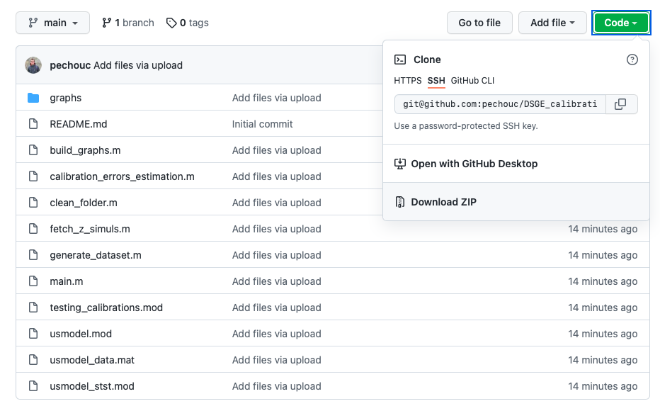

# Project presentation

This repository is part of an academic project conducted by Louis de Lachapelle, Vieu Lin and Paul-Emmanuel Chouc in the second year of the Master in Economics of Institut Polytechnique de Paris and for the course "Applied Macroeconometrics".

The goal of this project is to assess the sensitivity of the estimation of DSGE models to calibration, that is, we wish to check how the estimated parameters change as the values of some fixed parameters are modified. The methodology mainly draws on the paper "What to expect when you're calibrating: Measuring the effect of calibration on the estimation of macroeconomic models" by Nikolay Iskrev (Journal of Economic Dynamics and Control, 2019). It is applied to the seminal model of Smets & Wouters (2007). 

This repository hosts all the code required to reproduce our computations and the report can be found in the `assets` sub-folder.

# How to use the code in this repository?

## Download the code

If you are using `git`, you can use the following command to clone the repository locally:

```
git clone git@github.com:pechouc/DSGE_calibration.git
```

Alternatively, you can download the code as a zipped folder as on the following illustration:



You can then open the relevant working directory in Matlab. The sub-section below describes the broad organisation of the code.

## Description of the scripts

TO BE COMPLETED.
